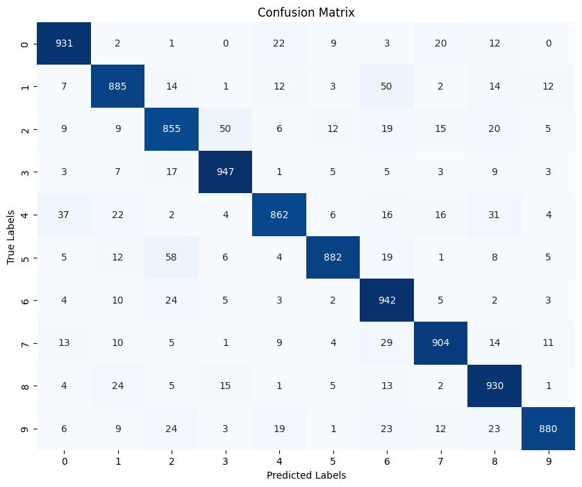

# Deep Learning Experiments on KMNIST
**Improving Neural Network Generalisation thorugh regularisation & hyperparameter tuning**

## Project Overview
This repository presents a series of structured deep learning experiments conducted on the KMNIST dataset (Kuzushiji-MNIST), a dataset of handwritten Japanese characters.

The goal of this project is to build a neural network classifier and iteratively improve its ability to generalise well to unseen data by addressing overfitting through regularisation methods and hyperparameter optimisation.


## Objectives
* Train a baseline neural network model on KMNIST
* Detect and analyse overfitting patterns
* Improve validation performance using:
  * Dropout
  * Early stopping
  * Weight decay (L2 regularisation)
* Tune key hyperparameters such as learning rate and batch size
* Identify the best-performing configuration for robust classification

## Dataset: KMNIST
KMNIST is a drop-in replacement for MNIST, containing:
* 70,000 grayscale images
* 10 classes of Kuzushiji (Japanese cursive) characters
* Image size: 28×28

It provides a more challenging classification task than standard MNIST.

## Experiment Summary
A progressive set of experiments was performed to improve model performance.

| Experiment                         | Description                                          | Key Outcome                                                                              |
| ---------------------------------- | ---------------------------------------------------- | ---------------------------------------------------------------------------------------- |
| **0: Baseline Model**              | Simple neural network trained without regularisation | Training accuracy reached **100%**, validation accuracy ~**89.27%** → strong overfitting |
| **1: Validation Monitoring**       | Added validation split and accuracy tracking         | Overfitting became visible after ~**10 epochs**                                          |
| **2: Dropout + Early Stopping**    | Introduced Dropout and early stopping                | Dropout **0.3** outperformed 0.5 and reduced overfitting                                 |
| **3: Increased Model Complexity**  | Added more layers to increase capacity               | Validation accuracy improved but overfitting still remained                              |
| **4: Weight Decay Regularisation** | Tested L2 penalty values: 1e-4, 5e-4, 1e-3           | Best validation accuracy achieved with **5e-4**                                          |
| **5: Learning Rate Tuning**        | Compared learning rates: 1e-4, 5e-4, 5e-3, 1e-3      | Default **1e-3** provided the most stable convergence                                    |
| **6: Batch Size Experiments**      | Tested batch sizes: 32, 64, 256                      | Batch size **32** remained the most effective                                            |

## Best Model Configuration
The strongest-performing model achieved the best validation performance using:
* Dropout: 0.3
* Weight Decay: 5e-4
* Learning Rate: 1e-3
* Batch Size: 32

This setup provided the best balance between learning capacity and generalisation.

## Final Results
**Validation Performance:**

* Final Validation Accuracy at Early Stop: 95.86%
* Peak Validation Accuracy: 96.04% (achieved at Epoch 13)

**Test Performance:**

* **Final Test Accuracy: 90.18%**
* Final Test Loss: 0.352

**Confusion Matrix**
The confusion matrix shows how the model performed on each KMNIST character class. Darker squares indiciate higher accuracy per class.




## Key Learnings


## Future Improvements


## Repository Contents
* Kmnist_notebook.ipynb

Full notebook containing all experiments, training loops, evaluation metris and results.
* README.md

Summary of experimental approach and findings

## How to Run
1. Clone the repository:

```
git clone https://github.com/Shawynot33/kmnist_deep_learning.git
```

2. Open the notebook:

```
jupyter notebook Kmnist_notebook.ipynb
```

3. Run all cells to reproduce the experiments.
